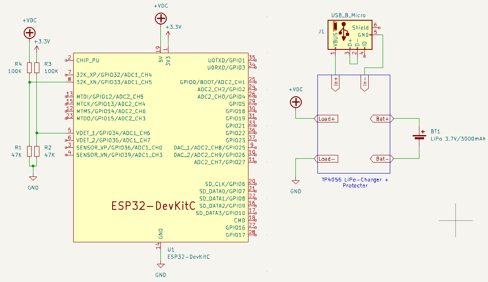

# BTHomeTrap IoT Mouse Trap
An ESP-IDF project which reads hall sensor in ULP unit and sends data encoded in the BTHome format over BLE.

The hall sensor of the ESP32 is read in Ultra Low Power coprocessor in deep-sleep mode with consumption about 0.00016A. When hall sensor value trips more than 15 units,
it wakes up main ESP unit, creates a BThome advertisment containing the event and its counts, adds the battery voltage and broadcasts the BLE signal (in BTHome standard), after that, it goes deep-sleep again.

# Instructions
1. Set up vscode with platform.io (recommended) or a CLI platform.io project
1. Run build
1. Upload to your board
1. Connect 5V/VBat through 100K/47K Divider to ADC1_CH6
1. Connect 3V3V through 100K/47K Divider to ADC1_CH5
1. Place the ESP32 where the magnet will appear
1. Power the board (with USB or with battery)
1. New BTHome device should appear in home-assistant automatically

# Assembly

# Home Assistant BThome

# References
1. [BTHome Water Meter](https://github.com/lipov3cz3k/bthome-watermeter)
1. [BTHome Weather Station](https://github.com/stumpylog/bthome-weather-station)
1. [ULP Pulse Counting Example](https://github.com/espressif/esp-idf/tree/v4.3.4/examples/system/ulp)
1. [BTHome](https://bthome.io/)

# Improvements
- Use even less power (maybe unmount the power LED of the ESP DevKit)
- Add OTA functionality